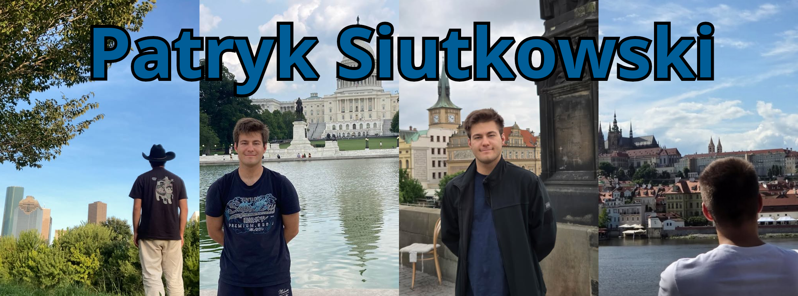

# Hello World, Patryk Here

## About Me

- Master's Computer Science Student at the University of Portsmouth
- Spend two semesters at Charles University in Prague
- Evolutionary Algorithms enthusiast
- Robotics and Drones enthusiast

## Currently working on

### Portfolio Website

A portfolio website about myself

### Gesture Recognition Program

A Python-based gesture recognition program that allows a computer
to be controlled without a keyboard.

Features include:

- Changing monitor brightness
- Controlling system volume
- Putting the computer to sleep

**Technologies:** Python, Computer Vision, MediaPipe

## Tech Stack

### Languages

### Technologies

### IDEs

## Github Stats

## Featured Repos

...

<!--  -->

## How to contact me

