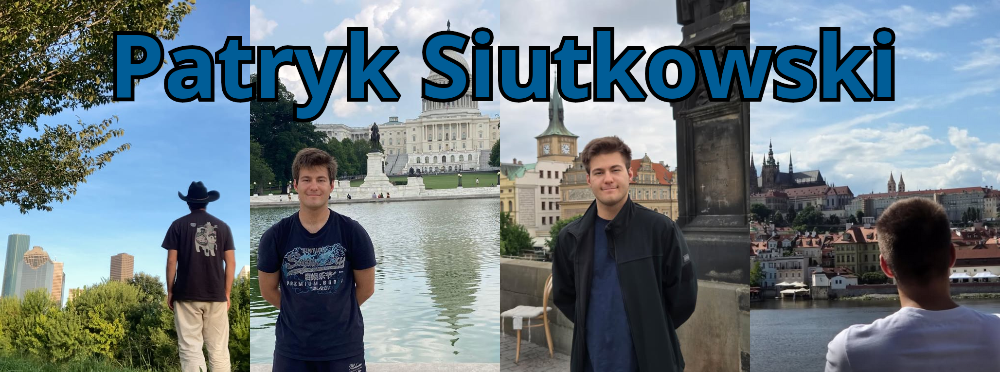

# Hello, Patryk Here

<!-- Colour Palette:
Text: ffffff
black: 000000
bg1:011f4b
bg2:03396c
bg3:005b96
bg4:6497b1
bg5:b3cde0
 -->

<!--  -->

## About Me

- Master's Computer Science Student at the University of Portsmouth
- Spend two semesters at Charles University in Prague
- Evolutionary Algorithms enthusiast
- Robotics and Drones enthusiast

## Current Projects

- Portfolio website about myself
- Gesture recognition program that allows a computer to be controlled without a keyboard.

## Tech Stack

### Languages

### Technologies

### IDEs

## Github Stats

## Featured Repos

...

## How to contact me

